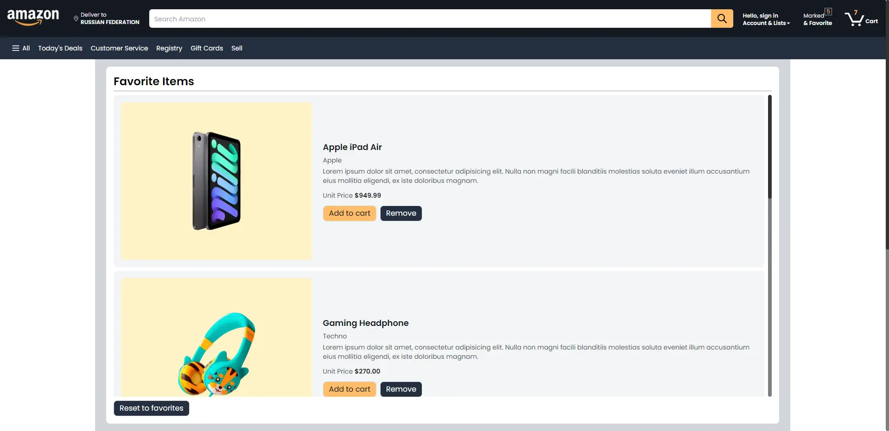

## My Amazone
### (My first Next.js project)

This is a [Next.js](https://nextjs.org/) project bootstrapped with [`create-next-app`](https://github.com/vercel/next.js/tree/canary/packages/create-next-app).

## Getting Started

First, run the development server:

```bash
npm run dev
# or
yarn dev
# or
pnpm dev
```

Open [http://localhost:3000](http://localhost:3000) with your browser to see the result.


This project [Demo](https://master--comfy-lily-1196c6.netlify.app/).

## Available Scripts

Used API: [US Zip Code Information](https://rapidapi.com/dkr73/api/us-zip-code-information),  [Fakestoreapiserver.reactbd](https://fakestoreapiserver.reactbd.com/tech).


Used by the library:

- next-auth;
- typescript;
- @reduxjs/toolkit;
- react-icons;
- tailwindcss;
- stripe;
- antd;
- framer-motion;
- @reduxjs/toolkit;
- sass;
- axios;
- react-responsive-carousel'





